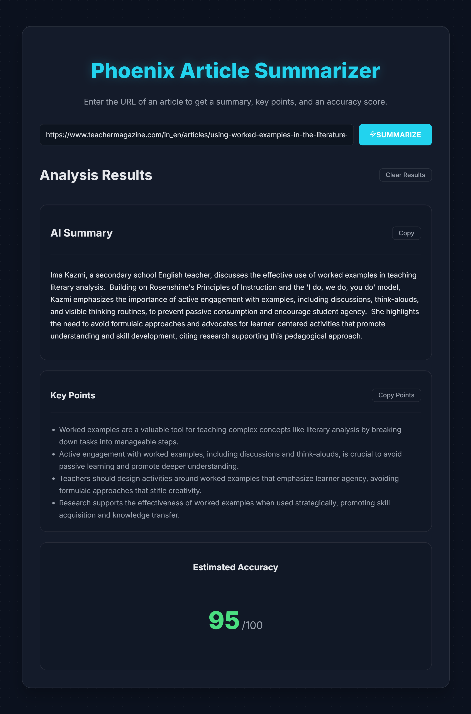

# Project Phoenix: AI Article Summarizer



A professional, full-stack web application that uses Google's Gemini AI to summarize web articles, extracts key points, and provides an estimated accuracy score.

**Live Demo:** [https://phoenix-summarizer.vercel.app](https://phoenix-summarizer.vercel.app)

---

## Features

-   **AI-Powered Summaries:** Get concise summaries of any online article.
-   **Key Point Extraction:** Automatically pulls out the most important bullet points.
-   **Accuracy Score:** The AI provides an estimated accuracy score (out of 100) based on the content's perceived factuality.
-   **Responsive Design:** A clean, mobile-first "Celestial" theme that works beautifully on any device.
-   **Secure & Scalable:** Built with a rate-limited, containerized backend deployed on a serverless cloud platform.

## Technology Stack

| Area             | Technology                                                                          |
| ---------------- | ----------------------------------------------------------------------------------- |
| **Frontend**     | React (Vite), Framer Motion, CSS3                                                   |
| **Backend**      | Python, Flask, Gunicorn                                                             |
| **AI Model**     | Google Gemini Pro                                                                   |
| **Deployment**   | Docker, Vercel (Frontend), Google Cloud Run (Backend), Google Artifact Registry     |

---

## Local Development Setup

This project uses Docker Compose to orchestrate the frontend and backend services for a simple and consistent local development experience.

**Prerequisites:**
- **Docker & Docker Compose:** Required to build and run the containerized services.
- **Node.js & npm:** Required by the frontend service for dependency management.
- **Git:** For cloning the repository.
- **gcloud CLI:** (Optional) For deploying to Google Cloud.

**1. Clone the repository:**
   ```bash
   git clone <YOUR_REPO_URL_HERE>
   cd phoenix-summarizer


2. Configure Environment Variables:
Backend: Rename backend/.env.example to backend/.env and add your GEMINI_API_KEY.
Frontend: Rename frontend/.env.example to frontend/.env (our docker-compose setup uses this).

3. Launch the application:
From the root phoenix-summarizer directory, run:
docker-compose up --build
The frontend will be available at http://localhost:5173. Any changes to the frontend or backend code will trigger an automatic reload.

This project was built to gain practical, end-to-end experience in modern web development, from UI design and containerization to cloud deployment and live debugging.

#### **Step 4: Commit and Push to GitHub**

Save your files, then run these commands in your terminal from the project's root directory:

# Stage the new README and the screenshot
git add .

# Commit the changes with a professional message
git commit -m "docs: Add professional README with setup instructions and screenshot"

# Push your beautiful documentation to GitHub
git push origin main